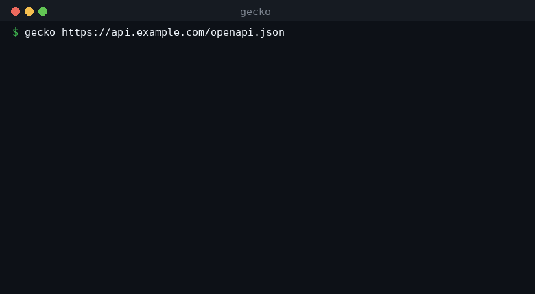
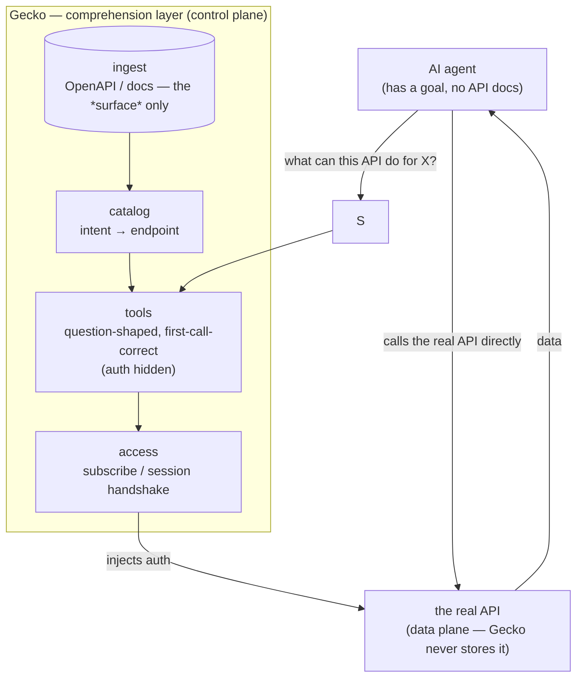

# gecko-surf — make any API agent-usable without integration code

<!-- mcp-name: tech.geckovision/surf -->

[](https://www.python.org/)
[](https://docs.astral.sh/uv/)
[](https://modelcontextprotocol.io/)
[](https://x402.org/)
[](#-status-honest)

> **Gecko is the comprehension layer for the agentic economy.** Point an agent at
> an API — even one behind human-shaped docs and a paywall — and it finds the right
> call, makes it correctly the first time, and runs. No client to write, no guessing
> whether the agent is calling it right.
>
> *Docs and endpoints are built for humans. Gecko translates them for agents.*

<p align="center">
  
</p>

Today a builder reads the docs, hand-writes a client, and **still can't tell if the
agent is calling the API correctly.** Gecko removes that step: it ingests an API's
*surface* (OpenAPI/docs), turns it into question-shaped, first-call-correct agent
tools, drives the access/auth handshake, and lets the agent call the **real API
directly** for data.

### Where Gecko sits — three verbs, three layers

| Layer | What it does | Who |
|---|---|---|
| APIs get **PAID** | billing / settlement rail | Metera (gate402), MCPay |
| skills get **DISTRIBUTED** | marketplace / discovery | frames.ag, Bazaar |
| **APIs get USED** | **comprehension / consumption** | **Gecko** |

Gecko **composes on top of** x402 / MCP / pay.sh — it *consumes* a payment catalog
as input. It is **not** a payment rail and **not** a marketplace. It is the layer that
makes an API actually *usable* by an agent.

---

## ⚠️ Status (honest)

V1 is **live on mainnet, end-to-end, against the real TxODDS World Cup API**: ingest →
comprehend → catalog → access (a two-token on-chain subscribe) → first-call-correct →
real data. A **$0 recorded mode** runs the entire path offline with no subscription.
**343 tests pass.**

What is **not** proven: **consumer willingness-to-pay** — the actual decider for the
business. That is discovery-interview work, not a demo claim. So: never read this repo
as *"Gecko is a proven business."* What is real today is a **working comprehension
path on one genuinely painful API**, and a clean, API-agnostic engine behind it.

---

## Architecture

Gecko is a **control plane**, not a data plane. It holds the API's *surface*, the
generated tool defs, and *correctness metadata* — it **never** stores response
payloads, user data, or secrets. That invariant is what lets it ingest any API
unilaterally.



1. **Ingest** the API surface (OpenAPI 3.x) → normalized operations + params (`$ref`
   resolved, cycle/depth guarded). Never the response data.
2. **Catalog** — a structured capability list (intent → endpoint). Lexical at this
   scale; no vectors.
3. **Comprehend** — each operation becomes a question-shaped tool def an agent picks
   correctly with no API docs. Auth headers are hidden.
4. **Access** — drive the access/subscription handshake; the seam is one function,
   `Session.auth_headers()`.
5. **Call** — the agent calls the real API directly; Gecko injects credentials and
   stays out of the data path.
6. **Validate** — replay calls, confirm first-call-correct, log outcomes (JSONL). That
   log is the seed of the V2 **correctness corpus** — the compounding moat.

---

## What you get

| Surface | Entry point | Status |
|---|---|---|
| **Serve any API to agents** (paste a spec → hosted MCP + one-click "add to Claude/Cursor") | `gecko serve <openapi-url>` (or bare `gecko <openapi-url>`) | shipped |
| **Generate + run first-call-correctness tests** (before any live call) | `gecko test <openapi-url> [-o test_api.py]` | shipped |
| **Recover a draft OpenAPI from human docs** (no spec? point it at the doc page) | `gecko from-docs <doc-url-or-path> [-o draft.json]` | shipped |
| **Embed the SDK** (`search / list_tools / prepare / call`) | `from gecko import AgentApiClient` | shipped |
| **Forkable starter** (an app on any API, ~20 lines, $0) | `examples/_starter/` | shipped |
| **$0 recorded demo** (goal → discover → correct call → data, offline) | `python -m gecko.demo` | runnable now |
| **Live demo** against real TxODDS World Cup data | `gecko.demo:live_demo` (after subscribe) | mainnet-proven |
| **Correctness harness** (first-call-correct + flywheel log) | `gecko.validator` | shipped |

---

## Make any API agent-usable

Point it at an OpenAPI and your agent can call it — no client code, auth handled,
first call correct.

**Serve it to your agent over MCP** — prints the MCP URL + one-click "add to Claude /
Cursor" strings:

```bash
# no install — run it straight from PyPI:
uvx --from "gecko-surf[serve]" gecko <openapi-url>
# or install the CLI (any system, no Python prereq):
curl -fsSL https://get.geckovision.tech/install.sh | bash
gecko <openapi-url>
```

It prints the comprehension summary, the MCP URL, and a one-click `claude mcp add` /
Cursor / VS Code string — then serves the API to your agent over Streamable-HTTP.

**Or embed the SDK** in your own app:

```python
from gecko import AgentApiClient, public_session

client = AgentApiClient(spec, session=public_session())
hit = client.search("what you want")[0]            # intent → right endpoint
client.call(hit["name"], {...}, mode="recorded")   # correct call; "live" for real data
```

A complete forkable example: [`examples/_starter/`](examples/_starter/) — an app on
*any* API in ~20 lines, runnable at $0. For a full agent (Telegram + an LLM tool-loop),
see [`examples/sos_vzla_bot/`](examples/sos_vzla_bot/).

---

## Develop / falsify offline ($0, no keys, no subscription)

```bash
git clone https://github.com/GeckoVision/gecko-surf
cd gecko-surf && uv sync
uv run pytest                       # 343 passing
uv run python -m gecko.demo      # E2E: goal → discover → correct call → data (recorded, $0)
```

The recorded demo runs the **same code path** as live — it just synthesizes responses
from the schema instead of hitting the network. That's the point: you can falsify the
comprehension offline before spending a cent.

---

## Going live (real World Cup data)

Recorded mode needs no subscription. For live data, do the one-time on-chain subscribe
— see [`scripts/SUBSCRIBE.md`](scripts/SUBSCRIBE.md) — then pass a real `Session`:

```python
from gecko.client import AgentApiClient
client = AgentApiClient(spec, base_url="https://...", session=my_session)
client.call(tool, args, mode="live")   # same path as recorded
```

> **Mainnet boundary:** the subscribe transaction is **founder-run only**. The tooling
> *simulates* (no spend) and hands over the exact command; a human broadcasts.

---

## What's in this repo

| Path | Purpose |
|---|---|
| `gecko/ingest.py` | OpenAPI 3.x → normalized `Operation`/`Param` (`$ref` resolution, guarded) |
| `gecko/catalog.py` | Lexical capability search (intent → endpoint) |
| `gecko/tools.py` | `Operation` → question-shaped agent tool defs (**auth hidden**) |
| `gecko/caller.py` | tool + args → correct `PreparedRequest` (stdlib `urllib`) |
| `gecko/access.py` | `Session.auth_headers()` — the engine/adapter seam; two-token session |
| `gecko/sample.py` | deterministic schema → example (powers $0 recorded mode) |
| `gecko/client.py` | `AgentApiClient` — `search / list_tools / prepare / call` |
| `gecko/mcp_server.py` | `McpSurface` — the agent-facing MCP surface |
| `gecko/validator.py` | replay + first-call-correct + JSONL outcome log (moat seed) |
| `gecko/demo.py` | `run()` (recorded) + `live_demo()` |
| `gecko/serve.py` | `gecko <url>` CLI — comprehend + serve over Streamable-HTTP MCP (+ one-click add) |
| `examples/_starter/` | forkable "app on any API" (engine-only, $0); `examples/sos_vzla_bot/` is the full LLM agent |
| `scripts/subscribe.py` | one-time on-chain subscribe (solders); simulate by default |
| `docs/` · `private/` | strategy & PRD · gitignored business docs (canvas, pitch, numbers) |

**Rule:** the comprehension logic is the product and lives in `gecko/`. The MCP
server, the client, and scripts are thin transport.

---

## Stack

| Layer | Tool |
|---|---|
| Language | Python 3.11+, managed with `uv` |
| Engine | stdlib-first (`urllib`); minimal deps; `pyyaml` for spec loading |
| Agent surface | `mcp` (Model Context Protocol) |
| Access / payments | x402; on-chain subscribe via `solders`; modes `stub` / `live` |
| Quality | `ruff` · `mypy` · `pytest` (343 tests) |

---

## Environment variables

**Source of truth:** [`.env.example`](.env.example).

| Variable | Required | Default | Notes |
|---|---|---|---|
| `X402_MODE` | no | `stub` | `stub` / `live`. **Stub is intentional during user-testing — do not flip to live without founder go-ahead.** |
| `TXODDS_*` / session file | for live only | — | live World Cup access after the on-chain subscribe (see `scripts/SUBSCRIBE.md`) |

Recorded mode and the test suite need **no** keys.

---

## Development

```bash
uv run ruff format && uv run ruff check --fix
uv run mypy gecko
uv run pytest                       # targeted invocations preferred
uv run python -m gecko.demo      # $0 recorded smoke
```

See [`CLAUDE.md`](CLAUDE.md) for the architecture invariants, the subagent team, and
conventions.

---

## Team

- **Ernani** ([@ernanibritto](https://x.com/ernanibritto)) — Technical co-founder.
  Builds the Gecko engine end-to-end: ingest, comprehension, the access layer, and
  the MCP surface.
- **Leticia** ([@0xLeti](https://x.com/0xLeti)) — Co-founder, Product Designer. 8+
  years designing for enterprises and startups; ex-Liga Ventures.

---

## License

**Apache License 2.0** — see [`LICENSE`](LICENSE) and [`NOTICE`](NOTICE). Apache-2.0 carries
an explicit patent grant. The engine is open (the distribution funnel); the correctness corpus
and hosted layer stay private (open-core).

---

*The comprehension layer for the agentic economy.*
