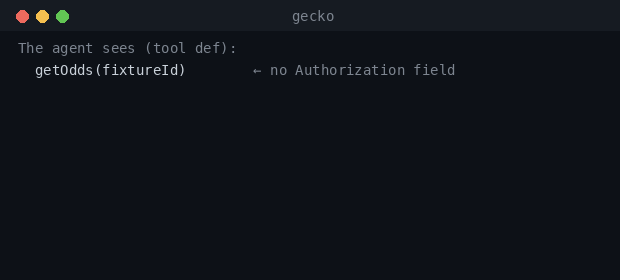
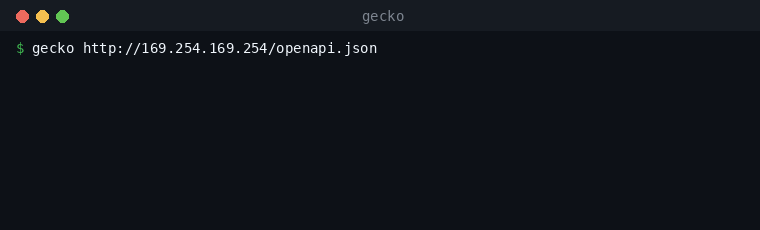

# FAQ

## Does Gecko work with any API?
Yes — anything with an OpenAPI 3.x spec. Point Gecko at the spec URL and it does the
rest: `gecko <openapi-url>` (equivalently `python -m gecko.serve <openapi-url>`) ingests
the spec, comprehends every operation, and serves it to your agent over MCP. Under the
hood the engine is fully API-agnostic — `ingest → catalog → tools → caller` never
contains a line of per-API code. The one thing that changes between APIs is a tiny auth
adapter (`Session.auth_headers()` in `gecko/access.py`), and for a public API that
adapter returns an empty dict (`public_session()`). No vendor allow-list, no waiting for
us to add support.

<!-- 🎬 GIF: paste a public OpenAPI URL into `gecko` → banner prints "comprehended N operations -> M usable" + the one-click add string. -->

## What if the API is painful — messy, sparsely documented, the kind a coding agent does *not* one-shot today?
That's the case Gecko is built for. Gecko reads the spec the way a careful integrator
would: it turns each operation into a *question-shaped* tool description with a JSON
schema for every input (`gecko/tools.py`), so the agent reasons about decision-relevant
inputs instead of guessing from a raw endpoint dump. Operations the current session can't
actually satisfy (e.g. an admin route with no credential) are *hidden* from the agent
rather than offered as a trap — so the agent doesn't waste a turn mis-calling something
it was never going to reach.

If the API has **no OpenAPI spec at all** — just human docs — that's the **docs → OpenAPI
on-ramp**, which is **designed, not yet built (coming / V2)**. Today you bring an
`openapi.json`; soon Gecko will generate one for you when you don't have it.

## Can I use a paywalled API? How do credentials work (BYOK)?
Yes — bring your own key. You pass a `Session` whose `auth_headers()` returns your
credentials, and Gecko injects them at call time, *inside* the request. Auth headers
(`Authorization`, `X-Api-Token`, `X-Api-Key`, …) are stripped from the agent-facing tool
definitions entirely (`gecko/tools.py`), so the agent describes intent and never sees,
handles, or logs a secret. For APIs with a real access handshake, the access seam drives
it end-to-end — V1 does a full two-token on-chain subscribe against the real, paywalled
TxODDS API without the agent ever learning the flow.

## What data does Gecko store?
The API *surface* and nothing else: the spec, the generated tool definitions, and
correctness metadata. Gecko is a **control plane** — it **never** stores response
payloads, user data, or secrets. The serve banner says it out loud:

> *Control plane: Gecko stores only the API surface — never your data, never response
> payloads, never secrets.*

This isn't just hygiene — it's *why we can ingest any API unilaterally.* Because Gecko
only ever touches the public shape of an API (and discards even the spec bytes after
parsing — see `gecko/netguard.py`), there's no data-governance reason a provider needs to
onboard us, sign off, or hand over anything. Your agent calls the upstream API
**directly** for the actual data; Gecko is never in the data path.

## Is this a marketplace or a payment rail?
No, and deliberately so. There are three different jobs in the agentic economy: APIs
getting **paid** (settlement rails — x402, Metera), skills getting **distributed**
(marketplaces — Bazaar, frames.ag), and APIs getting **used**. Gecko does only the third:
**comprehension and consumption.** We *compose on top of* MCP and x402 and consume a
payment catalog as an input — we don't re-list APIs and we don't move money. If you're
looking for a place to discover or bill for APIs, that's a layer below us; Gecko is the
layer that makes an API you already have actually callable by an agent.

## How is this different from an OpenAPI → MCP generator?
A spec-to-MCP generator does a 1:1 dump: every endpoint becomes a tool, auth headers
become input fields the agent has to fill, and you find out whether the call was
well-formed only after you spend the request. Gecko is the comprehension layer on top:

- **First-call-correct, falsifiable offline.** `mode="recorded"` synthesizes the response
  straight from the schema ($0, no network), so you can *prove* a call is well-formed
  before spending a cent or a token (`gecko/client.py`, `gecko/sample.py`).
- **Auth is invisible.** Credentials are removed from tool defs and injected at call time
  — the agent can't leak, mis-place, or be confused by them.
- **No-trap tool lists.** Ops the session can't satisfy are hidden, not offered.
- **The painful / no-spec case** (docs → OpenAPI) — *coming / V2*.
- **Stay-correct on new API versions** — an auto-update job that re-comprehends when the
  upstream API drifts — *designed, not built (coming / V2)*. See [Stay correct](stay-correct.md).

And one honest note on what's *not* magic yet: today the "find the right call" catalog is
**lexical** (`gecko/catalog.py`) — accurate and simple at tens of endpoints. The
**vectorized semantic index** is the large-API / multi-API play and is **deferred (V2)**.

---

## Data governance, in one paragraph

Gecko holds three things — the API's surface (the spec), the tool definitions generated
from it, and correctness metadata about how to call it right. It holds **none** of:
response payloads, user data, request bodies, or secrets. Every URL Gecko fetches on your
behalf is SSRF-validated first — non-http schemes, `file://`, loopback, private,
link-local, and cloud-metadata addresses (e.g. `169.254.169.254`) are all refused, and
redirects are re-validated hop by hop (`gecko/netguard.py`). Spec bytes are parsed and
discarded, never persisted. Your agent talks to the upstream API directly; Gecko is never
a man-in-the-middle on your data. That single invariant — *control plane, never data
plane* — is what makes unilateral ingestion safe.

