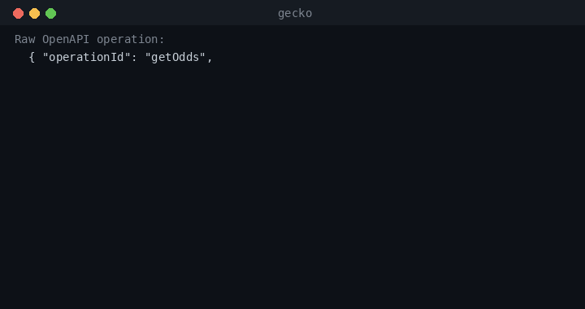

# How it works — the comprehension (semantic) layer

A normal API integration is a human reading the reference, hand-writing a client, and
hoping the agent fills the params right. Gecko replaces that with a pipeline that turns
the API's *surface* into agent-usable tools. Five stages, each one file, all
stdlib-portable.

```
  openapi.json (the API SURFACE)
        │
        ▼
  ┌──────────────┐   normalize: methods, paths, params, schemas
  │  ingest.py   │   $ref resolved · cycle+depth guarded · SURFACE ONLY
  └──────┬───────┘   → Operation / Param
         │
         ▼
  ┌──────────────┐   intent → endpoint
  │  catalog.py  │   LEXICAL today  ·  VECTOR index = V2 (see below)
  └──────┬───────┘   → ranked CatalogEntry
         │
         ▼
  ┌──────────────┐   Operation → question-shaped tool
  │  tools.py    │   JSON Schema per call · AUTH HIDDEN · _invoke metadata
  └──────┬───────┘   → MCP-compatible tool def
         │
         ▼
  ┌──────────────┐   tool + agent args → correct HTTP request
  │  caller.py   │   params placed by location · catches missing path params
  └──────┬───────┘   → PreparedRequest
         │
         ▼
  ┌──────────────┐   Session.auth_headers() injects credentials (BYOK)
  │  access.py   │   the ONE adapter seam · agent never sees tokens
  └──────┬───────┘
         │
         ▼   agent calls the REAL API directly
   ┌─────────────────────────┐
   │  recorded ($0, offline) │  sample.py synthesizes a valid response from schema
   │  live (real upstream)   │  caller.execute() · SSRF-guarded
   └─────────────────────────┘
        client.py (AgentApiClient) wires all five together
```

## 1. Ingest the surface — `gecko/ingest.py`

`load_spec()` reads an OpenAPI 3.x doc (YAML or JSON — `yaml.safe_load` parses both)
from a local path or an `http(s)` URL. Remote specs are fetched through `safe_get` (the
SSRF guard in `netguard.py`): the spec URL is untrusted input, so it's validated and the
fetch is capped before any bytes are trusted.

`extract_operations()` flattens `paths` into a normalized list of `Operation` records —
`method, path, operation_id, summary, description, tags, parameters, request_body,
responses, security` — with path-level params merged into each operation. `resolve_refs()`
dereferences local `$ref`s with a cycle guard and a depth cap; on a cycle it leaves the
`$ref` in place rather than expanding forever, so a self-referential schema still yields
something usable.

This is the **control-plane invariant in code**: ingest captures the *surface only*
(methods, params, request/response *schemas*) — never response payloads, user data, or
secrets.


## 2. Catalog — intent → endpoint (`gecko/catalog.py`)

`Catalog.search(query)` answers "which endpoint does the agent want?" Today it is
**lexical**: it tokenizes the query and each operation's surface text (`summary`,
`description`, `path`, `tags`, `operation_id`) and ranks by token overlap — with
**summary matches counted double** as the most intent-bearing field. Ties break on path
for determinism.

**Lexical now, vectors later — honestly labeled.** At single-API scale (tens of
endpoints) lexical is *more* accurate and far simpler than vector RAG — no embedding
model, no index, no drift, fully offline and deterministic. The **V2 vectorized semantic
index** is a drop-in upgrade behind the same `Catalog.search` contract; it flips when
retrieval quality degrades — i.e. when you're across **many APIs** or one with
**hundreds of endpoints** and lexical token-overlap starts returning the wrong call. We
ship it when we can *show* that gap, not on vibes.

> Status: lexical search is **live**. The vectorized semantic index is **designed, not
> built (V2)**.

## 3. Question-shaped, first-call-correct tools — `gecko/tools.py`

`to_tool(op)` is the comprehension payload — what separates Gecko from dumping raw
OpenAPI at a model. Each `Operation` becomes an MCP-compatible tool with:

- a **question-shaped `description`** that leads with the summary and spells out
  `Required:` / `Optional:` params, so the model knows what to fill;
- an **`inputSchema`** — a real JSON Schema per call (merges path/query params and the
  JSON request body into one `{type: object, properties, required}`), so the call is
  shaped correctly the first try;
- **auth hidden.** Known auth headers (`authorization, x-api-token, x-apikey, api-key,
  x-api-key`) are stripped from everything the agent sees. The agent reasons only about
  decision-relevant inputs; credentials are the access layer's job;
- **comprehension metadata** — `requires_auth` / `auth_schemes` (from OpenAPI `security`),
  and a hidden `_invoke` block (`method`, `path`, `param_locations`) so the caller builds
  the real request without re-parsing the spec.



## 4. Caller — build the correct request — `gecko/caller.py`

`build_request(tool, args, base_url, auth)` is where "no integration code" pays off. The
agent supplies meaningful values; the caller places each one where the spec says it goes
— `path` params substituted (URL-encoded) into the path, `header` params into headers,
everything else into the query string — then merges the injected `auth` dict in.
Critically it **catches the failure the agent can't see**: if a required `{path_param}`
is still unfilled, it raises `CallError` instead of firing a malformed request.
`execute()` (live mode only) runs the prepared request through `validate_public_url`
first — the base URL came from an untrusted spec, so it's SSRF-checked before the network
is touched.

## 5. Access seam — inject credentials — `gecko/access.py`

Auth is the *only* per-API adapter. The `AuthSession` protocol is the entire
engine/adapter seam: any object with `auth_headers() -> dict[str, str]`. A paywalled API
returns its tokens; a public API returns `{}` (`NoAuthSession` / `public_session()`);
`stub_session()` powers recorded mode. **BYOK**: the agent describes intent, Gecko
injects the key at call time, the token never appears in a tool def or a log. An empty
`auth_headers()` also signals the client to *hide* auth-gated operations the session
can't satisfy — so the agent is never shown a call it would only mis-fire.

## Putting it together — `gecko/client.py`

`AgentApiClient` wires the five stages: `load_spec → extract_operations → Catalog →
build_tools`, gated by what the session can authenticate (`_usable_tool_names`). Its
surface is `search()`, `list_tools()`, `prepare()`, and `call(mode="recorded" | "live")`:

- **`recorded`** — `sample.py` deterministically synthesizes a valid response *from the
  response schema* (same schema → same sample). **$0, offline, falsifiable** — you can
  verify the agent picks the right call and fills params correctly without a subscription
  or a network hop. This is the primary way to prove comprehension.
- **`live`** — the same prepared request, executed against the real upstream with the
  session's auth.

**One code path, two modes:** recorded and live differ only at the transport edge, so
what you falsify offline is exactly what runs live. And throughout, Gecko stays
**control-plane only** — it holds the surface, the tool defs, and correctness metadata;
the agent calls the real API directly and the response goes straight back to the agent,
never through Gecko's storage.
