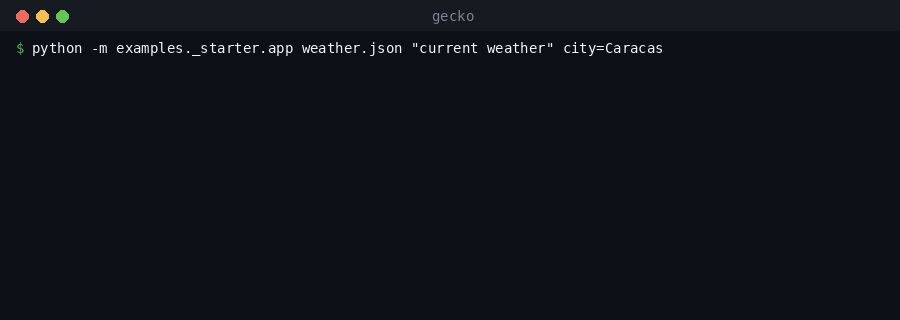

# Quickstart — make your API agent-usable in minutes

You bring an `openapi.json`. Gecko reads the API's *surface*, turns every endpoint into
a question-shaped, first-call-correct tool with a JSON schema, and hands your agent a
one-line "add me" string. No client to hand-write, no guessing whether the agent is
calling it right.

Two ways in — **serve it over MCP** (zero code, for Claude Code / Cursor / VS Code) or
**embed the SDK** (a few lines, for your own app). Both run the *same* comprehension
engine; both have a **$0 recorded mode** so you can falsify the calls offline before
spending a cent or a token.

<!-- 🎬 GIF: the paste→add→agent-calls-it loop — `gecko <url>` prints the add string, you paste it into Claude Code, the agent lists the tools and makes a correct first call. -->

## 1. Serve any API to your agent over MCP

The `gecko` CLI SSRF-validates the spec URL, comprehends it, prints a comprehension
summary + the MCP URL + a one-click add string for each host app, then serves the API
over Streamable-HTTP MCP. The MCP transport (mcp / uvicorn / starlette) lives behind the
optional **`serve` extra**, so install that:

```bash
# straight from PyPI, no clone (the `serve` extra adds mcp + uvicorn):
uvx --from "gecko-surf[serve]" gecko https://api.example.com/openapi.json

# or from a clone:
uv run --extra serve gecko https://api.example.com/openapi.json
```

You get back exactly this (grounded in `gecko/serve.py` and `gecko/deeplinks.py`):

```text
Gecko — make any API agent-usable (gecko-surf)
========================================================
comprehended 18 operations -> 14 usable as tools (4 auth-gated hidden from the agent)
Control plane: Gecko stores only the API surface — never your data,
never response payloads, never secrets.

MCP URL (Streamable HTTP):  http://127.0.0.1:8000/mcp

Add it to an agent (one step):
  Claude Code:  claude mcp add --transport http your-api http://127.0.0.1:8000/mcp
  Cursor:       cursor://anysphere.cursor-deeplink/mcp/install?name=your-api&config=...
  VS Code:      vscode:mcp/install?%7B%22name%22%3A%20%22your-api%22...%7D
```

(The server name defaults to the spec's title slug; override with `--name`. Auth-gated
operations are **hidden** from the agent unless the session can satisfy them — it can
only mis-call a tool it can't authenticate.)

Now connect your agent — pick your host app:

- **Claude Code** — paste the printed line:
  ```bash
  claude mcp add --transport http your-api http://127.0.0.1:8000/mcp
  ```
- **Cursor** — open the printed `cursor://…` deeplink (click it, or paste it into your
  browser's address bar). Cursor reads the base64 server config and adds the remote MCP
  server in one click.
- **VS Code** — open the printed `vscode:mcp/install?…` deeplink the same way. VS Code
  installs the `{ name, type: "http", url }` server entry.

That's the whole loop: paste a spec → get an add string → your agent can call the API,
first try.

> **Exposing it to a remote agent / hosted MCP?** Serve behind an HTTPS tunnel and
> advertise it with `--public-url https://<your-tunnel>` (it's printed in the add
> strings and trusted for the DNS-rebinding `Host`/`Origin` guard; add more with
> `--allow-host` / `--allow-origin`). Gecko also runs a hosted surface at
> `mcp.geckovision.tech`. Note the CLI **defaults to `--mode recorded`** ($0,
> synthesized) — pass `--mode live` only when you want real upstream calls.

## 2. Embed the SDK

If you're building your own app or agent loop, skip the server and import the engine —
no extras needed (`gecko/__init__.py`):

```python
from gecko import AgentApiClient, public_session

client = AgentApiClient(spec, session=public_session())      # spec = URL, path, or dict

hit = client.search("what you want", limit=3)[0]             # plain intent → right endpoint
result = client.call(hit["name"], {...}, mode="recorded")    # correct call, first try ($0)
# result -> {"status": 200, "request": <url>, "method": ..., "data": ..., "mode": "recorded"}
```

The contract is `search → call`: describe intent in plain language, get the matching
capability, make the call. Auth is injected at call time from the `Session` and is
**never** in the tool defs the agent sees. For a paywalled API, bring your own key via a
`Session` whose `auth_headers()` returns your credentials (BYOK).

Full, forkable example — an app on *any* API in ~20 lines: `examples/_starter/`. For a
complete LLM agent (Telegram + a tool-use loop), see `examples/sos_vzla_bot/`.

## 3. Falsify it offline first — `$0` recorded mode

`mode="recorded"` runs the **same code path** as live — it just synthesizes the response
from the API's own response schema instead of hitting the network (`gecko/client.py` →
`call`, powered by `gecko/sample.py`). No keys, no subscription, no spend. That's the
point: prove the call is well-formed and the agent picks the right endpoint *before* you
go live. (Mechanics: see [How it works](how-it-works.md).)



```bash
# the bundled E2E smoke: goal → discover → correct call → data (recorded, $0)
uv run python -m gecko.demo

# or run the starter against any public OpenAPI:
uv run python -m examples._starter.app \
  examples/sos_vzla_bot/spec/sosvenezuela_openapi.json \
  "how many people are reported missing"
```

When you're ready for real data, flip one argument — `mode="live"` (and pass an authed
`Session`). Same path, same tools.

## 4. No OpenAPI? We'll generate one — *coming (V2)*

> **Status: designed, not yet built.** Today Gecko needs an OpenAPI 3.x spec as input.
> The **docs→OpenAPI on-ramp** — point Gecko at an API's human docs and have it
> synthesize a spec — is on the V2 roadmap, alongside a **vectorized semantic index**
> (today's catalog is lexical — `gecko/catalog.py`) and an **auto-update** job that
> re-comprehends an API when it ships a new version (see [Stay correct](stay-correct.md)).
> Until those land, bring an `openapi.json`. Most APIs publish one; if yours is internal,
> generate it from your framework (FastAPI, NestJS, etc.).
