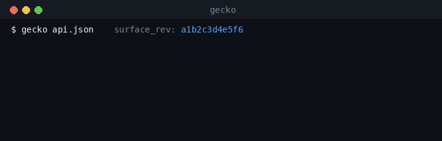

# Stay correct — when the API changes

It's Saturday. Nobody shipped anything. Your agent is down anyway.

Upstream renamed `customer_id` to `customerId`, moved `/v1/orders` to `/v2/orders`, and
tightened an enum. Your hand-written client knew none of this. It keeps sending the old
shape, the API keeps returning 422, and your agent keeps confidently retrying a call
that can no longer succeed. The API didn't break. *Your integration* did — silently, and
on a day you weren't watching.

This is the tax nobody quotes you when you hand-write an API client: **a client is a
frozen snapshot of an API that doesn't hold still.** Every rename, every new required
field, every relocated path is a manual diff a human has to notice, read, and re-code.
Multiply by the Nth painful API and "keep the integrations correct" becomes a standing
on-call burden.

## Why the generated-tool model changes the failure mode

Your agent never calls a hand-written client through Gecko. It calls **tools generated
from the spec.** Tool generation is a *pure function of the surface* — same spec in, same
tools out (`build_tools` in `gecko/tools.py`; the purity guarantee is documented in
`gecko/surfaces.py`). That one property makes drift tractable: if the source of truth
moves, the tools move with it — you don't hand-edit a client, you re-comprehend the
surface.

Gecko already knows *which* surface a tool came from, down to the exact revision:

```
surface_rev = sha256(canonicalized spec)[:12]   # gecko/surfaces.py
```

Same spec → same `surface_rev`. Any edit — a renamed field, a new path, a tightened enum
— bumps it. It's a content fingerprint for the API's entire shape, and it's already
stamped on everything: the cached comprehension in the Surface Registry
(`gecko/surfaces.py`), and **every correctness record** in the corpus (`surface_rev` on
`CallOutcome`, `gecko/corpus.py`).



## The stay-correct loop (design — coming in V2, not yet shipped)

The primitives below are live today. The **job that runs them on a schedule is designed,
not built.** Here is the loop, labeled honestly so you can see exactly where the line is:

1. **Notice** — poll the spec URL on an interval, or take a provider webhook, or
   re-scrape the docs. *(the watcher — coming)*
2. **Re-fingerprint** — recompute `surface_rev`. Unchanged? Nothing happened, stop.
   *(primitive shipped: `gecko/surfaces.py`)*
3. **Re-ingest** — run the same comprehension engine on the new spec. *(shipped:
   `gecko/ingest.py` → `gecko/tools.py`)*
4. **Diff the operations** — old `surface_rev` vs new: what params were added, removed,
   renamed, retyped; what endpoints moved. *(the op-level diff — coming)*
5. **Regenerate + flag what moved** — emit the new tool defs and surface a changelog:
   "`customer_id` → `customerId` on 3 tools; `/v1/orders` → `/v2/orders`." The agent gets
   correct tools; you get a human-readable record of the change. *(regeneration shipped
   as a pure function; the diff/flag report — coming)*

The honest status: **steps 2, 3, and 5's regeneration are shipped primitives. The watcher
(1), the operation-level diff (4), and the change report are designed and not yet built.**
We won't pretend the cron job exists. What exists is the architecture that makes it a
small, contained addition rather than a rewrite — because comprehension is already a pure
function of a content-addressed surface.

## The corpus is your early-warning system

There's a second drift signal that doesn't need the spec to change at all — because
providers don't always tell you.

Every call your agent makes through Gecko logs a **control-plane-only** outcome: status
class, error class, first-call-correct or not, and the `surface_rev` it ran against
(`gecko/corpus.py`, captured in `gecko/http_server.py`). **Never the response body, never
a param value, never a token** — the writer is a fail-closed allowlist, so a payload
physically can't enter the record.

That metadata stream is a drift tripwire. When a surface silently shifts under a stable
spec, you don't see a payload — you see the *shape of failure*: a tool that was
`first_call_correct` for ten thousand calls starts returning `unprocessable_422` or
`not_found_404`, all stamped with the same `surface_rev`. The corpus tells you *something
moved* before a human files a bug — and `gecko/validator.py` can replay every generated
tool against the new surface to confirm first-call-correctness still holds. *(Capture and
replay are shipped; "alert when a tool's error_class regresses" is the V2 monitor on top
of this data.)*

## The contrast, in one line

A hand-written client makes you the diffing engine: a human reads the changelog, edits
the code, and hopes they caught everything before Saturday. Gecko makes the **spec** the
source of truth and the **tools a regenerable function of it** — so a change propagates
instead of rotting, and the correctness corpus warns you when the surface moves out from
under a spec that never changed.

> **Shipped today:** content-addressed surfaces (`surface_rev`), comprehension as a pure
> function of the spec, the control-plane correctness corpus + validator replay.
> **Coming (V2):** the watcher (poll/webhook/re-scrape), the operation-level diff + "what
> moved" change report, and the regression alert on top of the corpus.
