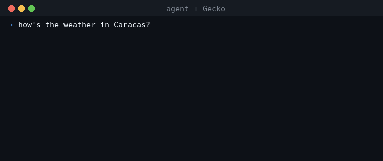

# Why Gecko — using vs. not using

## Today, an agent can only use an API a human already wrangled

To let an agent call an external API, someone has to read the reference, hand-write a
client, wire the auth, and then *guess* whether the agent is calling it right. The
agent never understands the API — it understands the wrapper you wrote. And only the
slice you surfaced (whatever made it into `llms.txt` or your hand-picked tools) gets
reliably reached; the rest of the API is invisible. When the provider ships a new
version, nothing tells you — your agent just starts calling it wrong.

That's days of glue code per API, repeated for every API, and you *still* can't prove
the call is correct until it fails in production.



## With Gecko: a comprehension layer the agent calls through

Point Gecko at an `openapi.json`. It comprehends the *surface* and turns every
operation into a **question-shaped, first-call-correct tool** with a **JSON Schema for
every call** (`gecko/tools.py` → `to_tool` emits `inputSchema`). The agent now
understands what the API can do and how to make each call — across the *whole* surface,
not just the part you remembered to expose. Auth is handled behind a single seam
(`gecko/access.py` → `Session.auth_headers()`) and never shown to the agent. Minutes,
not days.

```bash
# paste a spec; get a hosted MCP + one-click "add to Claude/Cursor"
gecko https://api.example.com/openapi.json
# → comprehended 42 operations -> 31 usable as tools (11 auth-gated hidden from the agent)
# → MCP URL + claude mcp add / Cursor / VS Code strings
```

(Verified in `gecko/serve.py`: SSRF-validate → comprehend → print summary + MCP URL +
one-click add strings → serve Streamable-HTTP MCP. Or embed the SDK:
`from gecko import AgentApiClient` — `search / list_tools / prepare /
call(mode="recorded"|"live")`, `gecko/client.py`.)

## Before vs. after

| | **Without Gecko** | **With Gecko** |
|---|---|---|
| **Onboard a new API** | Read the reference, hand-write a client (days per API) | Point at the spec; comprehended tools in minutes |
| **What the agent reaches** | Only what you surfaced / what's in `llms.txt` | The whole API surface, as picked-correctly tools |
| **Getting each call right** | Guesswork; you find out when it fails in prod | Question-shaped tool + JSON Schema per call, first-call-correct |
| **Try before you spend** | Hit the live API to find out it's wrong | `mode="recorded"` synthesizes from schema — $0, offline, falsifiable |
| **Auth / paywalled APIs** | You wire tokens by hand into agent prompts/tools | Injected at call time via `Session.auth_headers()`; **never shown to the agent** (BYOK) |
| **When the API changes** | Breaks silently; you debug blind | Re-point at the spec to re-comprehend in seconds *(automatic stay-correct: coming, V2)* |
| **Reuse across APIs** | Rewrite the glue for every API | One engine, any OpenAPI — same `search/call` contract everywhere |
| **What gets stored** | Your wrapper sees and may log responses | **Control plane only** — surface + tool defs + correctness metadata, never payloads/data/secrets |

## Why it holds up

1. **Any API, including the painful and paywalled ones.** Gecko ingests OpenAPI
   unilaterally — no provider cooperation needed. The target is the long-tail, messy,
   often-paywalled API your coding agent does *not* one-shot today. *(Have docs but no
   spec? The docs→OpenAPI on-ramp is coming — V2.)*
2. **Auth is invisible to the agent.** Auth params and gated operations are stripped
   from the tool defs the agent sees; credentials are injected at call time through one
   seam. BYOK works the same way — your keys never land in a prompt or a tool def.
3. **Control-plane data governance.** Gecko holds only the API's *surface* and
   correctness metadata — never response payloads, user data, or secrets. Your app
   calls the upstream API directly for data; Gecko stays out of the data path. That
   invariant is what makes unilateral ingest safe.
4. **Reusable across every API.** The engine is API-agnostic: the same `search /
   prepare / call` contract works on any OpenAPI, so integration work amortizes to
   zero. Proven end-to-end on a real, painful, paywalled API — TxODDS, via a full
   on-chain subscribe. Fork `examples/_starter/` — an app on any API in ~20 lines, $0 —
   or see `examples/sos_vzla_bot/` for a full LLM agent.

> **Honest note:** today the capability search is **lexical** (`gecko/catalog.py`); the
> vectorized semantic index is V2. And whether teams will *pay* for this is still being
> validated — Gecko is a working comprehension layer, not yet a proven business.

**Who it's for:** teams shipping production multi-agent / multi-API systems, at the
moment they hit the *Nth painful API* — long-tail, messy, poorly-documented, often
paywalled — that their coding agent can't already one-shot.
